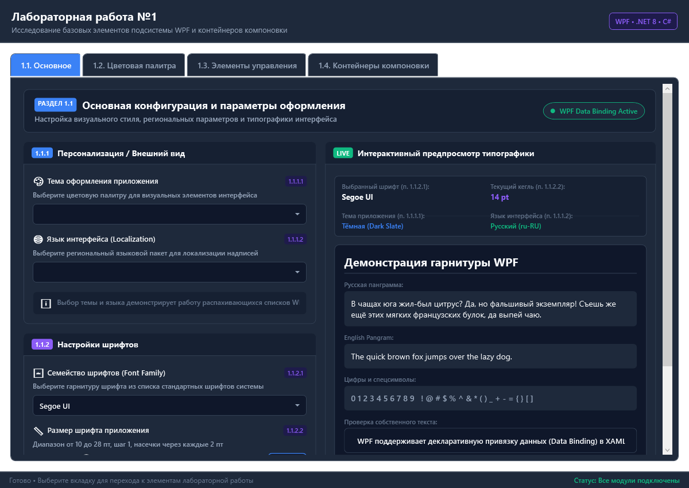
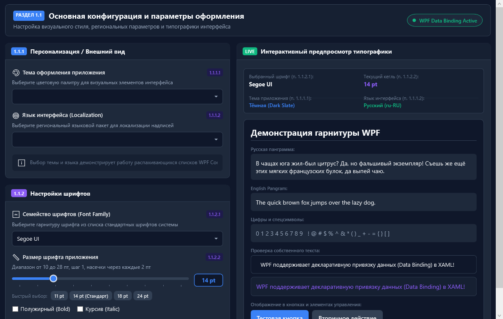
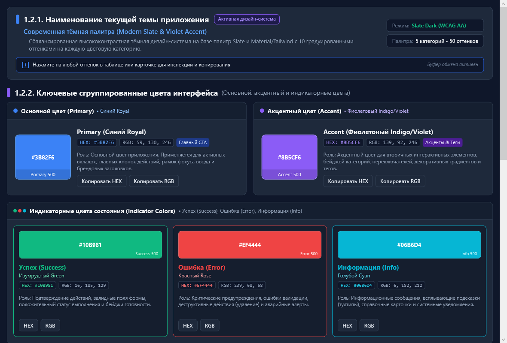
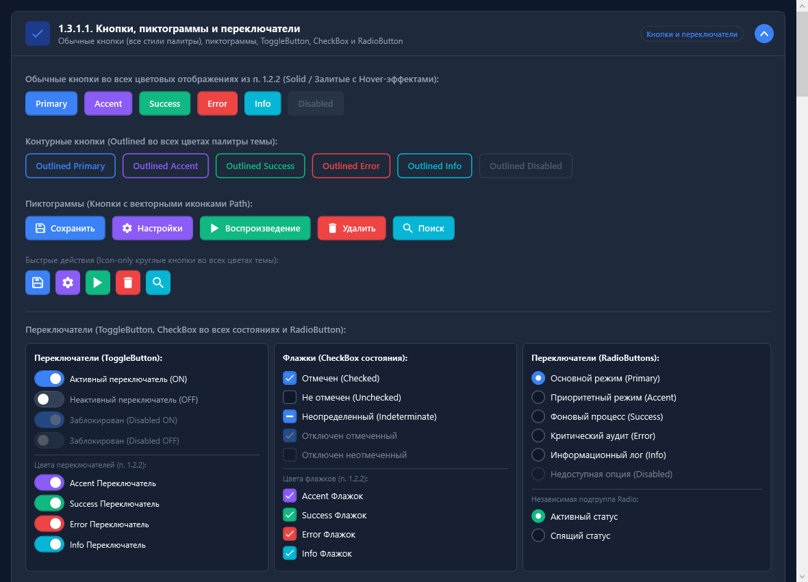
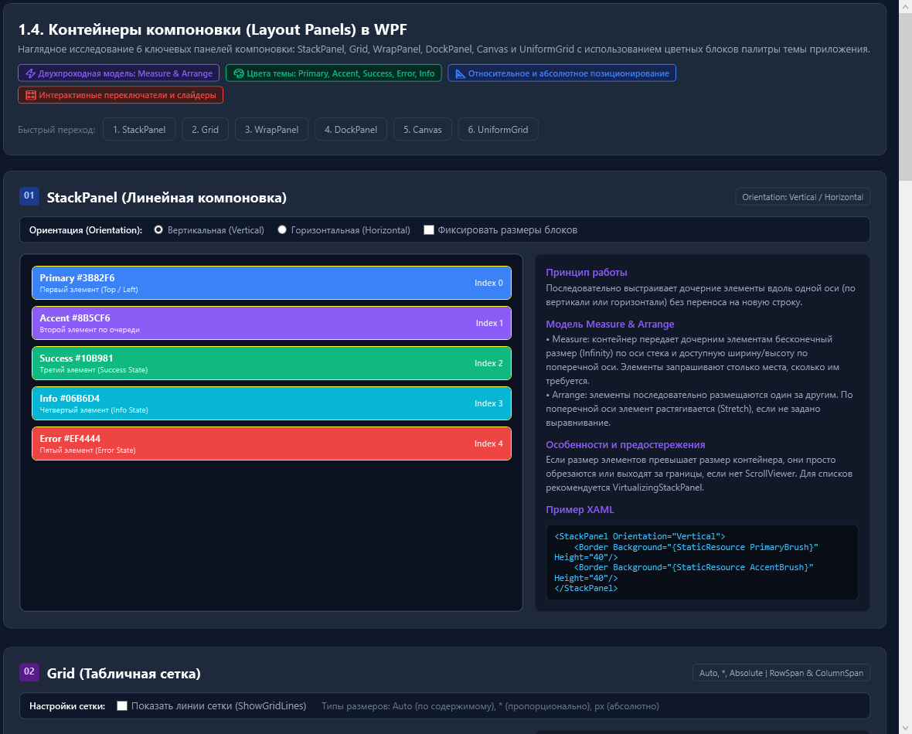

# Лабораторная работа № 1

## Тема: Исследование базовых элементов подсистемы Windows Presentation Foundation (WPF) и контейнеров компоновки графического интерфейса

### Сведения о работе
* **Учебное заведение:** Тверской государственный технический университет (ТвГТУ)
* **Факультет:** Факультет информационных технологий (ФИТ)
* **Дисциплина:** Объектно-ориентированное программирование (ООП)
* **Курс:** 2 курс
* **Семестр:** 3 семестр
* **Программный стек:** Microsoft .NET 8.0 SDK (C# 12), Windows Presentation Foundation (WPF), XAML

---

## 1. Цель и задачи работы

### 1.1. Цель
Изучение базовых концепций и программных средств подсистемы Windows Presentation Foundation (WPF), принципов декларативного описания интерфейса пользователя на языке XAML, механизмов шаблонизации (ControlTemplate, DataTemplate), системы ресурсов и стилизации, слабосвязанной архитектуры привязки данных (Data Binding) на основе паттерна Model-View-ViewModel (MVVM), а также двухпроходной модели компоновки элементов (Measure/Arrange).

### 1.2. Задачи
1. Спроектировать структуру WPF-приложения с разделением данных, логики представления и графических ресурсов в соответствии с принципами объектно-ориентированного проектирования и паттерна MVVM.
2. Реализовать многостраничный пользовательский интерфейс на базе элемента `TabControl` в строгом соответствии с техническим заданием.
3. Разработать модуль персонализации и параметров типографики (вкладка 1.1 «Основное»).
4. Разработать модуль палитры дизайн-системы, включающий 5 базовых категорий и параметрические матрицы оттенков (вкладка 1.2 «Цветовая палитра»).
5. Реализовать иерархическую витрину элементов управления, сгруппированных по контейнерам `Expander` с поддержкой различных состояний и цветов темы (вкладка 1.3 «Элементы управления»).
6. Провести сравнительный анализ и реализовать интерактивную демонстрацию алгоритмов работы базовых контейнеров компоновки WPF (вкладка 1.4 «Контейнеры компоновки»).
7. Обеспечить корректность компиляции проекта без предупреждений и ошибок (Zero-Warning Policy).

---

## 2. Спецификация программного комплекса и среды исполнения

| Параметр | Значение / Характеристика |
| :--- | :--- |
| Целевая платформа | Microsoft .NET 8.0 (TFM: `net8.0-windows`) |
| Язык программирования | C# версии 12.0 |
| Графическая подсистема | Windows Presentation Foundation (WPF) |
| Среда компиляции | .NET SDK 8.0 / MSBuild |
| Минимальные требования к ОС | Windows 10 (версия 1809+) / Windows 11 |
| Архитектурный шаблон | Model-View-ViewModel (MVVM) |
| Уровень связности | Слабая связность (Loose Coupling) через Data Binding и Command Pattern |

---

## 3. Архитектура программной системы

Проект организован по многоуровневой модульной структуре. Исходный код разбит на функциональные подсистемы:

```
WpfLabApp/
├── Common/                  Базовые классы инфраструктуры MVVM
│   ├── ObservableObject.cs  Реализация INotifyPropertyChanged с CallerMemberName
│   └── RelayCommand.cs      Типобезопасная реализация интерфейса ICommand
├── Converters/              Значения-конвертеры XAML (IValueConverter)
│   └── ValueConverters.cs   Преобразование булевых значений в перечисление Visibility
├── Models/                  Модели предметной области (Data Layer)
│   ├── Controls/            Структуры данных дерева (ProjectTreeNode) и таблицы (DataGridSampleItem)
│   ├── Palette/             Структуры представления цвета (ColorItem) и палитр (ColorGroup)
│   └── Personalization/     Опции локализации, тем и шрифтов
├── Services/                Служебный уровень взаимодействия с операционной системой
│   ├── Interfaces/          Контракты сервисов (INotificationService)
│   └── Implementations/     Реализация сервиса системных уведомлений и буфера обмена
├── ViewModels/              Модели представления (Presentation Logic Layer)
│   ├── MainWindowViewModel.cs       Управление глобальным состоянием окна
│   ├── MainTabViewModel.cs          Управление параметрами персонализации и Live Preview
│   ├── ColorPaletteViewModel.cs     Управление выборкой оттенков и инспекцией цветов
│   ├── ControlsViewModel.cs         Управление наборами данных TreeView и DataGrid
│   └── LayoutContainersViewModel.cs Параметры интерактивных полигонов компоновки
├── Views/                   Пользовательские интерфейсы (Presentation Layer)
│   ├── Main/                Представление вкладки 1.1 (MainTabView.xaml)
│   ├── Palette/             Представление вкладки 1.2 (ColorPaletteTabView.xaml)
│   ├── Controls/            Представления элементов управления (ControlsTabView, Part1, Part2)
│   └── Layout/              Представление панелей компоновки (LayoutContainersTabView.xaml)
├── Resources/               Декларативные словари ресурсов
│   ├── Theme/Colors.xaml    Цветовые константы и замороженные кисти (SolidColorBrush)
│   └── Icons/VectorIcons.xaml Векторные описания геометрии (StreamGeometry)
├── Styles/                  Централизованные стили элементов управления
│   └── AppStyles.xaml       Агрегирующий словарь ресурсов приложения
├── App.xaml (.cs)           Точка входа и инициализация среды WPF
└── MainWindow.xaml (.cs)    Корневой контейнер верхнего уровня
```

---

## 4. Спецификация и алгоритмический анализ контейнеров компоновки

В подсистеме WPF компоновка пользовательского интерфейса представляет собой рекурсивный двухпроходный процесс:
1. **Фаза измерения (`Measure` / `MeasureOverride`):** определение минимально необходимого размера элемента (`DesiredSize`) в рамках доступного пространства (`availableSize`).
2. **Фаза размещения (`Arrange` / `ArrangeOverride`):** окончательное позиционирование дочерних элементов и выделение им прямоугольных областей экрана (`finalSize`).

Ниже приведены характеристики исследованных контейнеров компоновки:

| Контейнер | Поведение главной оси | Поведение поперечной оси | Алгоритмическая сложность Measure/Arrange | Ограничение дочерних элементов | Назначение в интерфейсе |
| :--- | :--- | :--- | :---: | :--- | :--- |
| **StackPanel** | Последовательное наращивание (бесконечный размер по главной оси) | Растяжение до доступной ширины/высоты (`Stretch`) | $O(N)$ | Отсутствие переноса элементов; риск выхода за границы экрана без `ScrollViewer` | Линейные панели кнопок, тулбары, списковые формы ввода |
| **Grid** | Разделение по явным строкам (`RowDefinitions`) | Разделение по явным колонкам (`ColumnDefinitions`) | $O(N + R \cdot C)$ | Жесткая табличная привязка, поддержка относительных (`*`), фиксированных (`px`) и автоматических (`Auto`) величин | Каркасы сложных форм, главные компоновочные сетки окон |
| **WrapPanel** | Линейное размещение в текущей строке | Переход на следующую строку/колонку при $W > W_{avail}$ | $O(N)$ | Не требует явного объявления строк; динамический перенос элементов | Галереи карточек, каталоги однородных объектов, адаптивные теги |
| **DockPanel** | Прижатие к сторонам периметра (`Top`, `Bottom`, `Left`, `Right`) | Заполнение оставшегося пространства последним элементом (`LastChildFill`) | $O(N)$ | Зависимость итогового распределения от порядкового номера объявления дочерних узлов | Классические схемы интерфейса: Menu/ToolBar (Top), StatusBar (Bottom), Content (Center) |
| **UniformGrid** | Равномерное деление ширины на число столбцов ($W / C$) | Равномерное деление высоты на число строк ($H / R$) | $O(N)$ | Все ячейки имеют строго одинаковые геометрические размеры | Кнопочные панели калькуляторов, шахматные доски, модульные матрицы |
| **Canvas** | Абсолютное позиционирование ($X = \text{Left} \lor \text{Right}$) | Абсолютное позиционирование ($Y = \text{Top} \lor \text{Bottom}$) | $O(N)$ | Не выполняет автоматического выравнивания; элементы могут перекрывать друг друга по оси $Z$ (`Panel.ZIndex`) | Векторные редакторы, диаграммы, специализированные графические полигоны |

---

## 5. Соответствие техническому заданию

| Пункт ТЗ | Требование технического задания | Реализация в проекте | Классы и представления |
| :--- | :--- | :--- | :--- |
| **1.0** | Наличие набора вкладок на базе `TabControl` | Главное окно с четырьмя изолированными вкладками и навигационной стилизацией | `MainWindow.xaml`, `MainWindowViewModel.cs` |
| **1.1.1** | Сгруппированные настройки персонализации | `GroupBox` «Персонализация / Внешний вид». Раскрывающийся список тем оформления (`1.1.1.1`) и языков локализации (`1.1.1.2`) | `MainTabView.xaml`, `MainTabViewModel.cs`, `PersonalizationModels.cs` |
| **1.1.2** | Сгруппированные настройки шрифтов | `GroupBox` «Настройки шрифтов». Раскрывающийся список гарнитур (`1.1.2.1`) и ползунок кегля (`Slider`, 10–28 pt) (`1.1.2.2`). Блок динамического предпросмотра (Live Preview) | `MainTabView.xaml`, `MainTabViewModel.cs` |
| **1.2.1** | Вывод наименования текущей темы | Информационный баннер активной дизайн-системы с метаданными контрастности | `ColorPaletteTabView.xaml`, `ColorPaletteData.cs` |
| **1.2.2** | Сгруппированные цвета: основной, акцентный, индикаторные | Карточки представления пяти цветов: Primary, Accent, Success, Error, Info с выводом образца, HEX и RGB кодов | `ColorPaletteTabView.xaml`, `ColorItem.cs` |
| **1.2.3** | Таблицы палитры оттенков (10 градаций на цвет) | 5 параметрических таблиц `DataGrid` (ровно 50 оттенков) с колонками: Образец, Наименование, HEX, RGB, Роль в UI. Добавлен спектральный инспектор | `ColorPaletteTabView.xaml`, `ColorPaletteData.cs`, `ColorPaletteViewModel.cs` |
| **1.3.1.1**| Кнопки (обычные, пиктограммы, переключатели) | Кнопки во всех 5 цветах палитры, векторные пиктограммы `Path`, переключатели `ToggleSwitch`, `CheckBox` (3 состояния), `RadioButton` | `ControlsPart1View.xaml` |
| **1.3.1.2**| Текстовый ввод и списковые структуры | `TextBox` (5 состояний), `PasswordBox`, `ComboBox`, `ListBox`, `RichTextBox` (`FlowDocument`) | `ControlsPart1View.xaml` |
| **1.3.1.3**| Вывод текста (`TextBlock`, `Label`) | Параллельная шкала заголовков 1–3 уровня, обычного текста и подписи для обоих классов. Реализованы мнемоники `AccessKey` | `ControlsPart1View.xaml` |
| **1.3.1.4**| Иерархический список `TreeView` | 4-уровневое дерево структуры решения с кастомным шаблоном `HierarchicalDataTemplate` и рекурсивным управлением | `ControlsPart2View.xaml`, `DataModels.cs` |
| **1.3.1.5**| Табличное представление `DataGrid` | Таблица с типизированными столбцами, индикаторными бейджами, чередованием строк и сортировкой | `ControlsPart2View.xaml`, `DataModels.cs` |
| **1.3.1.6**| Индикаторы выполнения `ProgressBar` | Детерминированный и недетерминированный варианты, представленные во всех пяти цветах палитры | `ControlsPart2View.xaml` |
| **1.3.1.7**| Всплывающие подсказки `ToolTip` | Стандартные строковые, кастомные карточные подсказки и статусные варианты (Success, Info, Warning, Error) | `ControlsPart1View.xaml` |
| **1.3.1.8**| Главное и контекстное меню | Верхнее многоуровневое меню (`Menu`) с акселераторами и контекстные меню (`ContextMenu`) элементов | `ControlsPart2View.xaml` |
| **1.4** | Контейнеры компоновки | Наглядная сравнительная демонстрация 6 панелей компоновки на геометрических блоках палитры темы | `LayoutContainersTabView.xaml`, `LayoutContainersViewModel.cs` |

---

## 6. Графические материалы (Контрольные снимки экранов)

| Раздел интерфейса | Иллюстрация |
| :--- | :--- |
| **Общий вид главного окна приложения** |  |
| **Вкладка 1.1 «Основное» (Параметры персонализации и шрифтов)** |  |
| **Вкладка 1.2 «Цветовая палитра» (Таблицы 50 оттенков)** |  |
| **Вкладка 1.3 «Элементы управления» (Распахиваемые контейнеры)** |  |
| **Вкладка 1.4 «Контейнеры компоновки» (Сравнительный полигон)** |  |

---

## 7. Инструкция по сборке и запуску программного комплекса

### 7.1. Сборка решения через командный интерфейс .NET CLI
```powershell
# Клонирование репозитория
git clone https://github.com/Mesokiiii/lab_1_Sozontov_OOP.git
cd lab_1_Sozontov_OOP

# Восстановление пакетов и компиляция решения
dotnet build WpfLab1.sln --configuration Release
```

### 7.2. Запуск приложения
```powershell
# Запуск исполняемого проекта
dotnet run --project WpfLabApp\WpfLabApp.csproj
```

Вспомогательный пакетный файл для запуска в среде Windows:
```cmd
run.bat
```

---

## 8. Дополнительная документация

* **Полный академический отчёт по лабораторной работе:** [REPORT.md](REPORT.md)
* **Архитектурный регламент и стандарты чистого кода:** [docs/ARCHITECTURE.md](docs/ARCHITECTURE.md)
* **Исходное техническое задание кафедры:** [task.txt](task.txt)
